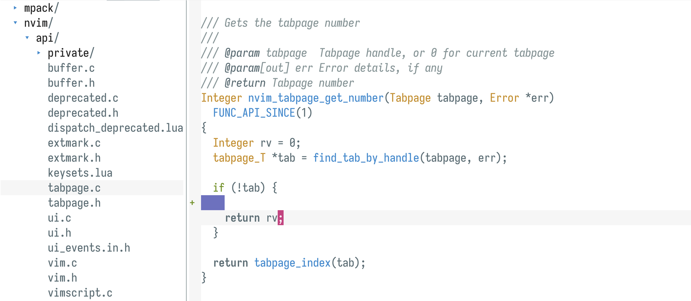

# 🌝 Lunarised



**Lunarised** is a customised derivative of Solarized that tweaks the colour
palette to remove the light yellows to make everything a bit more neutral.
Solarized is a great theme, but those yellow backgrounds really can wear you
down after long periods.

This theme is written in Lua and targets **Neovim ≥0.5** exclusively, with
built-in support for native **LSP**, **Treesitter**, **Lualine**, **NERDTree**,
and **GitGutter**.

## Usage

Install the plugin using your favourite method, such as [Packer][0]:

```lua
require('packer').startup(function()
	use 'alexblackie/lunarised'
end)
```

And then you can just load the theme in your `init.lua`:

```lua
require('lunarised').load()
```

or `init.vim`:

```viml
colorscheme lunarised
```

If your terminal supports it, you can enable italicised comments:

```lua
vim.g.lunarised_italic_comments = true
```

Or if you prefer a dark theme, you can toggle that on:

```lua
vim.g.lunarised_dark = true
```

This theme also supports **Lualine**, just use the `lunarised` theme:

```lua
require('lualine').setup {
	options = {
		theme = 'lunarised'
	}
}
```

[0]: https://github.com/wbthomason/packer.nvim

## Contributing

You are welcome to propose changes, however this theme was written by me
([@alexblackie](https://github.com/alexblackie)) and primarily meant to conform
to my personal preferences. If you want to make opinionated or larger changes,
you're likely better off forking and making your own version!
