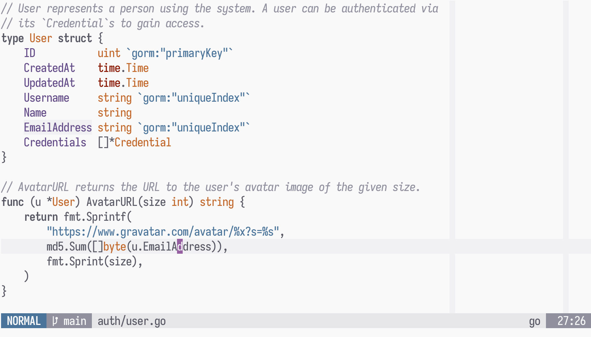

# 🌝 Lunarised



**Lunarised** is a customised derivative of Solarized Light that removes the
yellow tint and brings the whole palette towards a more neutral tone. Through
the Treesitter support, it also tries to highlight only the things that matter,
instead of trying to assign colour just for the heck of it.

This theme is written in Lua and targets **Neovim ≥0.5** exclusively, with
built-in support for native **Treesitter**, **Lualine**, **NERDTree**, and
**GitGutter**.

## Usage

Install the plugin using your favourite method, such as [Packer][0]:

```lua
require('packer').startup(function()
	use 'alexblackie/lunarised'
end)
```

And then you can just load the theme in your `init.lua`:

```lua
require('lunarised').load()
```

or `init.vim`:

```viml
colorscheme lunarised
```

If your terminal supports it, you can enable italicised comments:

```lua
vim.g.lunarised_italic_comments = true
```

This theme also supports **Lualine**, just use the `lunarised` theme:

```lua
require('lualine').setup {
	options = {
		theme = 'lunarised'
	}
}
```

[0]: https://github.com/wbthomason/packer.nvim

## Contributing

You are welcome to propose changes, however this theme was written by me
([@alexblackie](https://github.com/alexblackie)) and primarily meant to conform
to my personal preferences. If you want to make opinionated or larger changes,
you're likely better off forking and making your own version!
